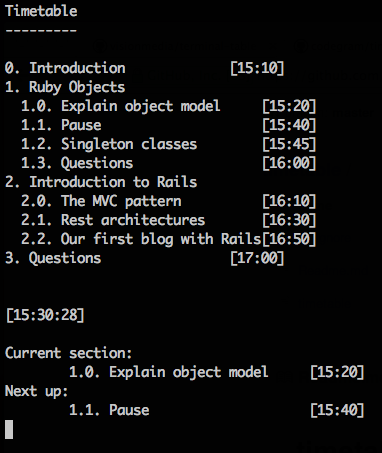

# timetable

Timetable is a 200-LOC script that parses structured content as YAML (for
example, sections of a course/talk you're giving or tasks you have to do)
and schedules this data from a start time. Optionally, it can give you hints
about the current task/section you're in and the next one. Man today I'm not
explaining myself well.

## Installing

    $ curl https://raw.github.com/codegram/timetable/master/timetable > timetable
    $ chmod +x timetable
    $ ./timetable something.yml [start time like 16:42] --[report|run]

## Usage

Let's see an example. Imagine we're organizing a basic Ruby/Rails class for
people who are new to Ruby. We might sketch the course structure in a YAML
file, along with the duration of each section in minutes, like this (these are
the contents of the `example.yml` included in this repo):

    - Introduction: 10
    - Ruby Objects:
      - Explain object model: 20
      - Pause: 5
      - Singleton classes: 15
      - Questions: 10
    - Introduction to Rails:
      - The MVC pattern: 20
      - Rest architectures: 20
      - Our first blog with Rails: 10
    - Questions: 10

Now we decide our class starts at 15:10. So we get timetable:

    $ curl https://raw.github.com/codegram/timetable/master/timetable > timetable
    $ chmod +x timetable

We grab the example yaml (or the one you just created):

    $ curl https://raw.github.com/codegram/timetable/master/example.yml > example.yml

And we run first a report to check the schedule of the class:

    $ ./timetable example.yml 15:10 --report

    0. Introduction             [15:10]
    1. Ruby Objects
      1.0. Explain object model     [15:20]
      1.1. Pause                    [15:40]
      1.2. Singleton classes        [15:45]
      1.3. Questions                [16:00]
    2. Introduction to Rails
      2.0. The MVC pattern          [16:10]
      2.1. Rest architectures       [16:30]
      2.2. Our first blog with Rails[16:50]
    3. Questions                [17:00]

## Live mode

We can also get information live, throughout the class, by running the `--run`
flag:

    $ ./timetable example.yml 15:10 --run

And imagining we're already at 15:30 and the course has started, we get this
information, updated every second:

## Running the tests

If you run `timetable` without any arguments, it will run its test suite to
check it's working ok.

## License

MIT License. Copyright 2011 [Codegram Technologies](http://codegram.com)
